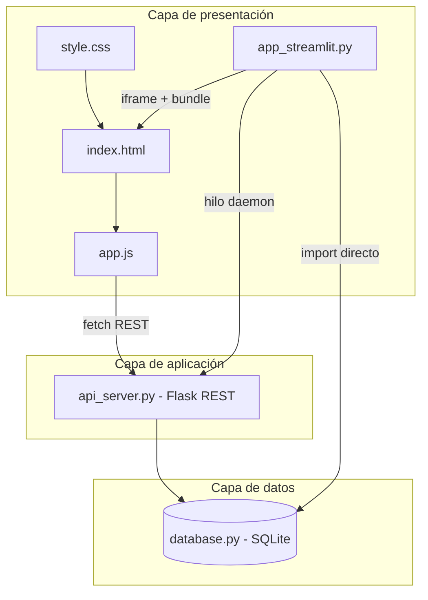

# DHP — Declaración de Historial Personal

Sistema web para la **Declaración de Historial Personal (DHP)** del Cuerpo de Ingenieros de la Armada Bolivariana. Permite capturar datos en un asistente por pasos, guardar expedientes, exportar/importar JSON, imprimir la planilla oficial de **4 páginas** y administrar registros en **SQLite**.

**Repositorio:** [github.com/Darrez654/historial-de-personal](https://github.com/Darrez654/historial-de-personal)

---

## Tabla de contenidos

1. [Arquitectura general](#arquitectura-general)
2. [Detalle de cada archivo](#detalle-de-cada-archivo)
3. [Métodos de estructuración](#métodos-de-estructuración)
4. [Patrones de diseño (software)](#patrones-de-diseño-software)
5. [Patrones de estilo (UI/CSS)](#patrones-de-estilo-uicss)
6. [Modelo de datos canónico](#modelo-de-datos-canónico)
7. [Cómo ejecutar el proyecto](#cómo-ejecutar-el-proyecto)
8. [Streamlit Cloud](#streamlit-cloud)

---

## Arquitectura general

El proyecto sigue una **arquitectura en capas** con **tres clientes** que comparten el mismo modelo JSON:



| Capa | Responsabilidad |
|------|-----------------|
| **Presentación** | Formulario wizard, tema claro/oscuro, impresión, UI Streamlit |
| **Aplicación** | API REST en Flask (`/api/records`) |
| **Datos** | Persistencia SQLite con documento JSON por expediente |

---

## Detalle de cada archivo

### Frontend (aplicación web principal)

| Archivo | Función |
|---------|---------|
| **`index.html`** | Estructura semántica del sistema. Define el layout (`app-container`), **sidebar** con 9 pasos del wizard, **9 secciones** de formulario (`form-step`), panel de utilidades (tema, export/import, BD) y el contenedor de **impresión** (`print-sheet-container`) con las 4 hojas oficiales. No contiene lógica; solo marcado y IDs estables para `app.js`. |
| **`style.css`** | Hoja de estilos única (~1.600 líneas). Variables CSS (design tokens), layout flex pantalla completa, componentes (cards, inputs, tablas), **colores por módulo** (1–8), tema oscuro (`body.dark-theme`) y reglas **`@media print`** para la salida en papel. |
| **`app.js`** | Lógica del cliente en JavaScript vanilla. Wizard, tablas dinámicas, sincronización pantalla↔impresión, auto-guardado en `localStorage`, export/import JSON, llamadas a la API y `window.print()`. Todo el código vive dentro de un listener `DOMContentLoaded` (módulo por closure). |

### Backend y persistencia (Python)

| Archivo | Función |
|---------|---------|
| **`database.py`** | Capa de acceso a datos (**Repository** sobre SQLite). Crea la tabla `dhp_records`, normaliza cédulas, y expone: `init_db`, `save_or_update_record`, `get_all_records`, `get_record_by_cedula`, `delete_record`. El formulario completo se guarda como **JSON serializado** en `json_data`. |
| **`api_server.py`** | Servidor **Flask** con **CORS** habilitado. Expone endpoints REST para el frontend. Puerto configurable con `DHP_API_PORT` (default `8765`). Función `start_api_server()` usada por Streamlit en un hilo en segundo plano. |
| **`app_streamlit.py`** | Orquestador alternativo/host. Tres modos en pestañas: (1) **iframe** con la web embebida a pantalla completa, (2) formulario nativo Streamlit, (3) gestor de expedientes. Adaptadores JSON↔`session_state`, inyección HTML autocontenido y arranque de la API en **thread daemon**. |

### Configuración, dependencias y arranque

| Archivo | Función |
|---------|---------|
| **`requirements.txt`** | Dependencias Python: `streamlit`, `pandas`, `flask`, `flask-cors`. |
| **`.streamlit/config.toml`** | Tema visual de Streamlit (colores Armada), `gatherUsageStats = false`, servidor headless. |
| **`.gitignore`** | Excluye `__pycache__/`, `*.db`, `.env` (la base local no se sube a Git). |
| **`iniciar_streamlit.bat`** | Script Windows: detecta Python (`py -3` o `python`), instala `requirements.txt`, ejecuta `streamlit run app_streamlit.py`. |
| **`Iniciar DHP.vbs`** | Acceso directo sin consola: lanza el `.bat` en ventana `cmd /k` para ver errores. |

### Generados en tiempo de ejecución (no versionados)

| Archivo | Función |
|---------|---------|
| **`dhp_records.db`** | Base SQLite local creada por `database.init_db()`. |
| **`__pycache__/`** | Bytecode Python compilado. |

---

## Funciones y módulos clave por archivo

### `database.py`

| Función | Descripción |
|---------|-------------|
| `init_db()` | Crea tabla e índice por cédula si no existen. |
| `_normalize_cedula(cedula)` | Normaliza a mayúsculas sin espacios (regla de negocio). |
| `save_or_update_record(...)` | INSERT o UPDATE según exista la cédula. |
| `get_all_records(search_query)` | Listado con búsqueda opcional LIKE. |
| `get_record_by_cedula(cedula)` | Devuelve dict con `data` ya parseado desde JSON. |
| `delete_record(cedula)` | Elimina por cédula; retorna `bool`. |

### `api_server.py`

| Ruta | Método | Descripción |
|------|--------|-------------|
| `/api/health` | GET | Estado del servicio. |
| `/api/records` | GET | Lista expedientes (`?q=` búsqueda opcional). |
| `/api/records/<cedula>` | GET | Un expediente completo. |
| `/api/records` | POST | Guardar/actualizar (`cedula`, `nombre`, `apellido`, `data`). |
| `/api/records/<cedula>` | DELETE | Borrar expediente. |

### `app.js` (agrupado por responsabilidad)

| Bloque / función | Descripción |
|------------------|-------------|
| `tablesConfig`, `eduStages` | **Configuración declarativa** de tablas y etapas educativas. |
| `addRowToScreen`, `removeDynamicRow` | Filas dinámicas con límite según planilla oficial. |
| `showStep`, `validateCurrentStep` | **Wizard** de 9 pasos con validación mínima. |
| `syncSimpleFields`, `syncDynamicTable`, `syncCheckboxes` | Copia valores del formulario a la vista de impresión. |
| `compileFormState` / `loadFormState` | Serialización y deserialización del modelo JSON DHP. |
| `triggerAutoSave` / `saveDataToLocalStorage` | Auto-guardado con **debounce** (1 s). |
| `searchRecordsInDatabase`, `saveRecordToDatabase`, … | Cliente HTTP hacia Flask (`fetch`). |

### `app_streamlit.py`

| Función | Descripción |
|---------|-------------|
| `apply_streamlit_layout_styles()` | CSS inyectado: ancho completo, iframe viewport. |
| `ensure_api_server()` | Inicia Flask una sola vez en hilo daemon. |
| `load_json_to_streamlit_state` / `compile_streamlit_state_to_json` | **Adaptadores** entre JSON canónico y widgets Streamlit/pandas. |
| `get_self_contained_html()` | **Bundle runtime**: fusiona HTML+CSS+JS e inyecta `PRELOADED_DHP_DATA`. |
| `render_integrated_web_app()` | Muestra la web local en `components.html`. |
| `render_records_manager()` | CRUD visual sobre SQLite. |
| `main()` | Punto de entrada; pestañas y flujo principal. |

---

## Métodos de estructuración

### 1. Separación por tecnología (no monolito único)

- **HTML** = estructura y contrato de IDs (`f_*`, contenedores, pasos).
- **CSS** = apariencia y reglas de impresión.
- **JS** = comportamiento.
- **Python** = persistencia, API y host Streamlit.

No hay bundler (Webpack/Vite): se prioriza **simplicidad de despliegue** y compatibilidad con Streamlit Cloud.

### 2. Modelo de datos único (JSON canónico)

Toda la app gira en torno a un objeto JSON con cuatro ramas:

```json
{
  "photo": "data:image/...",
  "theme": "light|dark",
  "simpleFields": { "f_cedula": "...", "...": "..." },
  "dynamicTables": { "familiares": [], "viajes": [], "...": [] },
  "education": { "primaria": { "desde": "", "...": "" } }
}
```

Streamlit y la web **no duplican** el modelo: cada uno tiene adaptadores hacia este formato.

### 3. Convención de nombres para campos

| Prefijo | Uso |
|---------|-----|
| `f_` | Campo simple en formulario e impresión |
| `f_{tabla}_{campo}_{índice}` | Celda de tabla dinámica |
| `f_edu_{campo}_{etapa}` | Educación por etapa |

Esto permite recorrer el DOM de forma predecible sin frameworks.

### 4. UI dual: pantalla + impresión

- **Pantalla:** `.app-layout`, sidebar sticky, `.form-step` (solo uno visible).
- **Impresión:** `.printable-sheet` oculto en pantalla; visible solo con `@media print`.
- **Sincronización:** al escribir, `sync*` copia valores a nodos `#print-*` para que `window.print()` refleje el borrador actual.

### 5. Orquestación Streamlit (patrón host + embed)

1. `set_page_config(layout="wide")` lo antes posible.
2. API Flask en **hilo daemon** (no bloquea la UI).
3. Pestaña principal: **HTML autocontenido** inyectado en iframe (`components.html`).
4. Pestaña secundaria: formulario nativo para quien prefiera Python/pandas.
5. Pestaña administrativa: gestión directa de SQLite.

### 6. Configuración declarativa (tablas y educación)

En lugar de codificar cada fila a mano en HTML, `app.js` usa objetos de configuración (`tablesConfig`, `eduStages`) que generan filas y límites según el formato oficial (p. ej. máximo 5 familiares).

---

## Patrones de diseño (software)

| Patrón | Dónde se aplica | Propósito |
|--------|-----------------|-----------|
| **Arquitectura en capas (3-tier)** | JS → Flask → SQLite | Separar UI, lógica de aplicación y persistencia. |
| **Repository** | `database.py` | Ocultar SQL y detalles de SQLite al resto del sistema. |
| **API REST / Resource-oriented** | `api_server.py` | Contrato HTTP estable para el frontend (`/api/records`). |
| **Facade** | `database.py` + funciones de `app_streamlit` que llaman a `db.*` | Interfaz simple para guardar/cargar sin exponer SQL. |
| **Adapter (anti-corruption)** | `load_json_to_streamlit_state`, `compile_streamlit_state_to_json` | Traducir JSON canónico ↔ widgets Streamlit/DataFrames. |
| **Wizard / Step-by-step** | Sidebar + `showStep()` en `app.js` | Dividir 9 módulos del DHP sin abrumar al usuario. |
| **Configuration-driven UI** | `tablesConfig`, `eduStages` | Generar UI repetitiva desde metadatos, no copiar HTML. |
| **Observer + Debounce** | `triggerAutoSave` + `setTimeout` | Reaccionar a `input` sin saturar `localStorage`. |
| **State / Session (Singleton por sesión)** | `st.session_state`, `localStorage` | Mantener borrador y flags (`api_thread_started`). |
| **Composition / Embed** | `get_self_contained_html()` + `components.html` | Reutilizar la web completa dentro de Streamlit sin duplicar código. |
| **Thread-per-background-service** | `threading.Thread(..., daemon=True)` | Servir API Flask en paralelo al servidor Streamlit. |
| **Strategy (implícita)** | Tres pestañas en Streamlit | Misma BD, distintas UIs (web embebida, nativa, admin). |
| **Module pattern (IIFE por closure)** | `DOMContentLoaded` en `app.js` | Encapsular estado (`currentStep`, `photoBase64`) sin contaminar `window` (salvo `removeDynamicRow` y `PRELOADED_DHP_DATA`). |

### Principios adicionales

- **KISS:** sin frameworks frontend; despliegue directo desde archivos estáticos.
- **DRY en datos:** un solo JSON; varias vistas (web, impresión, Streamlit).
- **Fail-fast:** validación de cédula en `database.py`; respuestas HTTP 400/404 en API.
- **Separation of concerns:** impresión no mezcla lógica en Python; vive en CSS+JS.

---

## Patrones de estilo (UI/CSS)

| Patrón / técnica | Implementación en `style.css` |
|------------------|-------------------------------|
| **Design tokens (CSS Custom Properties)** | Bloque `:root` con `--bg-primary`, `--accent`, `--radius-*`, sombras y transiciones. |
| **Theming (class-based)** | `body.dark-theme` sobrescribe variables para modo oscuro. |
| **Layout: Sidebar + Main (Flexbox)** | `.app-layout` + `.sidebar` sticky `100vh` + `.main-content` con scroll independiente. |
| **Color por módulo** | `--color-modulo-1` … `--color-modulo-8` para identificar visualmente los 8 bloques del formulario. |
| **Glassmorphism / cards** | `--card-bg` semitransparente, bordes suaves, `backdrop-filter` en cabeceras Streamlit. |
| **Component styling** | Clases reutilizables: `.form-group`, `.repeating-row`, `.btn-primary`, `.edu-grid-row`. |
| **Dual rendering (Screen vs Print)** | Pantalla: `.printable-sheet { display: none }`. Impresión: `@media print` oculta `.app-layout` y muestra `.print-page`. |
| **Print fidelity** | `print-color-adjust: exact` para conservar colores institucionales en PDF. |
| **Tipografía dual** | Google Fonts: **Outfit** (títulos) + **Inter** (cuerpo). |
| **Responsive** | Media queries para grids y sidebar; parche `DHP_EMBED_CSS` en Streamlit para iframe al 100%. |

### Streamlit (`STREAMLIT_FULLSCREEN_CSS`)

- Anula `max-width` del contenedor de Streamlit.
- Iframe a `calc(100vh - 5.5rem)` para experiencia **casi pantalla completa** en Cloud.
- Oculta toolbar/decoration de Streamlit para acercarse a la app local.

---

## Modelo de datos canónico

```
dhp_records (SQLite)
├── id (PK)
├── cedula (UNIQUE, indexado)
├── nombre, apellido
├── json_data  →  { photo, theme, simpleFields, dynamicTables, education }
├── fecha_creacion
└── fecha_actualizacion
```

La **cédula** es la clave natural del negocio; el JSON es el documento completo del expediente.

---

## Cómo ejecutar el proyecto

### Requisitos

- Python 3.10+ (recomendado 3.11/3.12)
- Navegador moderno (Chrome, Edge, Firefox)

### Opción A — Windows (recomendada)

1. Doble clic en **`Iniciar DHP.vbs`** o **`iniciar_streamlit.bat`**.
2. Se abre Streamlit en el navegador (por defecto `http://localhost:8501`).
3. La API Flask arranca en `http://127.0.0.1:8765`.

### Opción B — Terminal manual

```bash
pip install -r requirements.txt
streamlit run app_streamlit.py
```

### Solo frontend estático (sin BD)

Abrir `index.html` en el navegador funciona para diseño y borrador local (`localStorage`), pero **guardar en SQLite requiere** Streamlit o `python api_server.py` en otra terminal.

---

## Streamlit Cloud

| Campo | Valor |
|-------|--------|
| **Main file path** | `app_streamlit.py` |
| **Layout** | `wide` (en código + `.streamlit/config.toml`) |

**Limitaciones en Cloud:**

- La API en `127.0.0.1:8765` **no es accesible** desde el navegador del usuario final (corre en el servidor de Streamlit, no en su PC).
- Use la pestaña **Interfaz Web** para el formulario e impresión; use **export/import JSON** como respaldo.
- La base `dhp_records.db` en Cloud es efímera salvo que se use almacenamiento persistente del proveedor.

---

## Estructura de carpetas

```
historial-personal-app/
├── index.html              # Vista principal + plantillas de impresión
├── style.css               # Estilos pantalla e impresión
├── app.js                  # Lógica del formulario wizard
├── database.py             # Capa SQLite (Repository)
├── api_server.py           # API REST Flask
├── app_streamlit.py        # Host Streamlit + embed + formulario nativo
├── requirements.txt
├── iniciar_streamlit.bat
├── Iniciar DHP.vbs
├── .streamlit/config.toml
├── .gitignore
└── dhp_records.db          # Generado localmente (no en Git)
```

---

## Licencia y uso

Proyecto académico/institucional para gestión de historiales personales. Verifique normativas de protección de datos personales antes de desplegar con información real.
